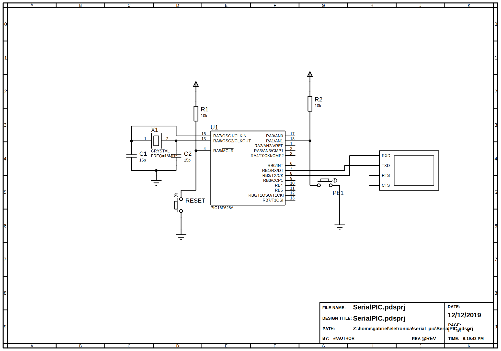

# SerialPIC

Small example of UART communication using PIC16F628A. When *PB1* is pressed, a message "OK" is sent through UART.

# Schematic

A schematic for the circuit is provided below

# Tools used

Built with Microchip MPLAB X IDE and XC8 compiler Free.
